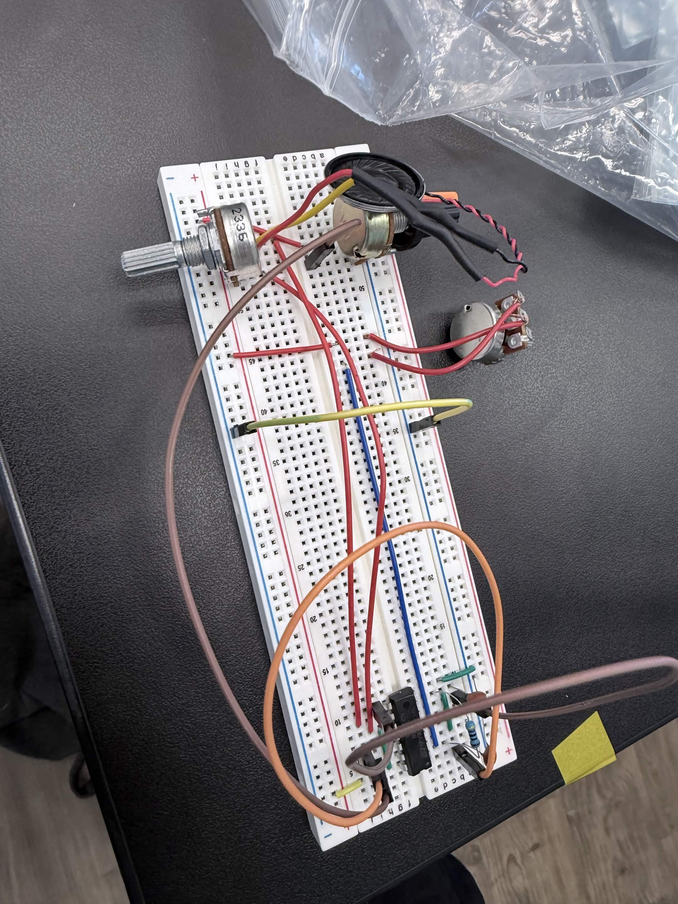
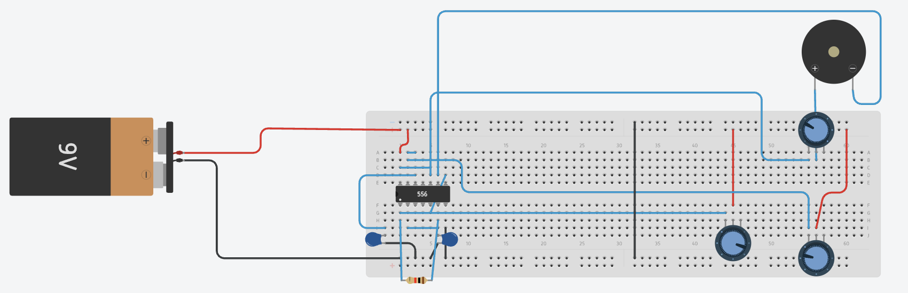

# Atari Punk Synthesizer 
My project is an Atari Punk Synthesizer, an analog electronic instrument that generates a variety of retro-style sounds using a 556 timer chip. The user can adjust the pitch, tone, and volume with three potentiometers to create different sound effects.

```HTML 
<!--- This is an HTML comment in Markdown -->
<!--- Anything between these symbols will not render on the published site -->
```

| **Engineer** | **School** | **Area of Interest** | **Grade** |
|:--:|:--:|:--:|:--:|
| Grace G | Lynbrook High School | Mechanical Engineering | Incoming Senior

**Replace the BlueStamp logo below with an image of yourself and your completed project. Follow the guide [here](https://tomcam.github.io/least-github-pages/adding-images-github-pages-site.html) if you need help.**


  
# Final Milestone

<iframe width="560" height="315" src="https://www.youtube.com/watch?v=eSRVPmxoq2w" title="YouTube video player" frameborder="0" allow="accelerometer; autoplay; clipboard-write; encrypted-media; gyroscope; picture-in-picture; web-share" allowfullscreen></iframe>

## Description 
For my final milestone, I transformed my breadboard prototype into a much more permanent and portable synthesizer. I transferred the entire circuit onto a solderable perfboard, which replaced the temporary jumper-wire connections with soldered electrical connections. I also designed and 3D modeled a custom enclosure using CAD to organize and protect the electronics.

## Final Design

### Perfboard Assembly
The largest change was transferring every component from the breadboards onto solderable breadboards and a perfboard.

Unlike a breadboard, where components can simply be plugged in, every electrical connection on a perfboard must be made manually using solder. This required carefully planning the layout before soldering to avoid crossing wires and to keep the circuit organized.

Moving to a perfboard also reduced the number of loose jumper wires, making the synthesizer much easier to transport.

# picture 

### CAD

After completing the electronics, I designed a custom enclosure using CAD software.

The enclosure holds the perfboards securely while providing openings for the potentiometers, push buttons, switches, LEDs, and speaker. Creating the enclosure required measuring the dimensions of every component and arranging the layout so the controls were easy to reach while keeping the overall design compact.

# picture

## Challenges

The biggest challenge during this milestone was soldering the circuit onto the perfboard. Unlike the breadboard, where mistakes could be corrected in seconds, every solder joint was a permanent electrical connection. Planning where each wire should go, especially the shared ground connections, was much more difficult than I expected.

I also discovered that soldering itself requires practice. Sometimes the solder would not flow properly or would create weak joints that had to be removed and redone before the circuit would work reliably.

Although the synthesizer functions, some of the potentiometer connections are still mechanically weak, causing the circuit to work only intermittently. Debugging these problems taught me that a reliable electronic device depends not only on the circuit design but also on the quality of the physical construction.

## Future Improvements

Although the synthesizer is complete, there are still several improvements I would like to make.

First, I want to strengthen the potentiometer connections so the circuit operates more reliably. I would also like to redesign parts of the wiring layout to make the internal connections cleaner and easier to maintain.

In the future, I'd also like to expand the synthesizer by adding a keyboard, additional oscillators, and more sound effects to create an even wider variety of sounds.

# Second Milestone

**Don't forget to replace the text below with the embedding for your milestone video. Go to Youtube, click Share -> Embed, and copy and paste the code to replace what's below.**

<iframe width="844" height="475" src="https://www.youtube.com/embed/k7cU7gvNjDI" title="Grace G. Milestone 2" frameborder="0" allow="accelerometer; autoplay; clipboard-write; encrypted-media; gyroscope; picture-in-picture; web-share" referrerpolicy="strict-origin-when-cross-origin" allowfullscreen></iframe>

## Description 
For my second milestone, I expanded the original Atari Punk Synthesizer by adding several new modules that give me more control over the sound. Other than simply producing electronic tones, the synthesizer can now generate modulation effects, amplify its audio output, and offer much greater control over how the sound is changed.

### Updated Circuit Diagram
Unlike the first milestone, this stage involved integrating multiple independent circuits into one system. Because of the increased complexity, I switched from Tinkercad to Fritzing, which offers a wider selection of electronic components and makes it easier to represent my circuit accurately.

fritizing.png

## Overall Design
The synthesizer now consists of three main subsystems: the original 556 timer circuit that generates the sound, the XR2206 low-frequency oscillator that modulates the sound, and the LM386 amplifier that boosts the output.

m2project.png 

## Components 
### LM386 Audio Amplifier
One of the largest additions was an LM386 audio amplifier, which strengthens the audio signal produced by the synthesizer before sending it to the speaker.

The audio signal enters pin 3 through the 5 kΩ volume potentiometer. The LM386 amplifies this signal, which then exits through pin 5, passes through a coupling capacitor, and finally reaches the speaker. Several capacitors were also added around the amplifier to improve power stability and reduce unwanted noise. Because the amplifier is powered by its own battery, I also added an LED to indicate when it is receiving power.

amplifier.jpeg

### XR2206 Low-Frequency Oscillator (LFO)
Another major addition was an XR2206 function generator, which works as a Low-Frequency Oscillator (LFO).

Unlike the 556 timer, which creates audible frequencies, the XR2206 generates frequencies below approximately 20 Hz. Since these frequencies are below the range of human hearing, they are not heard directly. Instead, the LFO changes the frequency of the 556 oscillators, producing modulation effects such as vibrato.

I have a total of 3 potentiometers. The first potentiometer is connected to pin 7 which then controls the LFO speed, allowing the modulation to range from slower to much faster oscillations.

The LFO signal leaves pin 2 of the XR2206 and is divided into two independent paths. Each path contains its own **100 kΩ potentiometer** followed by a **10 kΩ resistor** before connecting to one of the two control inputs on the 556 timer(pins 3 and 11). This allows me to independently adjust how much modulation each oscillator receives, giving me much more control over the synthesizer's sound. 

LFOimage.jpeg

## Challenges

The biggest challenge during this milestone was integrating all of the new components together. Although there were many tutorials explaining the audio amplifier, the function generator, and the 556 timer individually, I could not find instructions showing how to combine them into a single synthesizer. Because of this, I spent much of my time reading datasheets to understand the purpose of each pin instead of simply following tutorials. I experimented with different resistor values, wiring configurations, and modulation methods until the individual modules finally worked together.

Testing also proved more difficult than I expected. Since everything was still assembled on breadboards, every work session began by checking that each jumper wire was fully inserted. Even one loose connection could prevent the entire synthesizer from working. To improve this, I replaced several jumper wires with flatter connections that fit more securely into the breadboard.

Overall, this milestone taught me that building electronics is not only about assembling circuits—it is also about understanding how different systems communicate and learning how to interpret datasheets when no complete instructions exist.

## Next Steps 
For my final milestone, I plan to solder the complete circuit onto a perfboard/solderable breadboard to create a more permanent version of the synthesizer. I also plan to design a custom CAD enclosure that organizes the electronics into a portable case instead of an exposed breadboard. Finally, I plan to improve the overall layout of the synthesizer by organizing the wiring.

# First Milestone

<iframe width="860" height="484" src="https://www.youtube.com/embed/eSRVPmxoq2w" title="Grace G. Milestone 1" frameborder="0" allow="accelerometer; autoplay; clipboard-write; encrypted-media; gyroscope; picture-in-picture; web-share" referrerpolicy="strict-origin-when-cross-origin" allowfullscreen></iframe>

## Description 
For my first milestone, I built the basic version of the Atari Punk Synthesizer on the breadboard.

 

### Tinkercad Schematic 
 


Before building the physical circuit, I recreated the entire design in Tinkercad. This allowed me to verify that the circuit worked before assembling it on the breadboard. To keep the schematic easy to read, I color-coded all of the wires. Red wires are connected to positive power, black wires are connected to ground, and blue wires represent all other signal connections.

The goal of this milestone was to create a functioning synthesizer that could generate different electronic tones using analog circuits. Building the circuit on a breadboard also allowed me to easily test, troubleshoot, and modify the design before creating a permanent version.

## Components 

### 556 Timer 
The Atari Punk Synthesizer is built around a 556 timer integrated circuit, which contains two 555 timers inside a single chip. These timers work together to generate square-wave signals that produce the sound. The first timer works as an oscillator that generates square waves at a specific frequency which is determined by the connected capacitors and resistors. The second timer is also set up as an oscillator and works by modulating the first timer, creating the electronic sounds that the Atari Punk Synth is known for.

556_image.png

### Potentiometers
The synthesizer uses three potentiometers:

* Two 500kΩ potentiometers control different aspects of the oscillator frequencies, allowing the pitch and tone to be changed 
* One 5kΩ potentiometer controls the output volume by adjusting the signal sent to the speaker.

### Capacitors
The capacitors are used to determine the timing of the oscillators because the speaker converts the electrical square-wave signals into actual sound. Together, these components create an analog synthesizer that can produce a wide range of electronic tones.

## Challenges
One of the biggest challenges I faced was learning how to use both Tinkercad and breadboard circuits, since I had very little experience with either before starting this project. So this challenge came with troubleshooting the circuit when it initially failed to produce any sound. 

During troubleshooting, we used an oscilloscope which lets us see the electrical signals in the circuit. The oscilloscope displays how voltage changes over time. This helped us check whether the 556 timer was producing the expected square wave output.  

We also used a function generator, which produces electrical signals such as square, sine, and triangle waves. It can be used to inject known signals into a circuit to test individual places and help find the source of the problem.

Eventually, I discovered that the speaker wires were not making good contact with the breadboard. After fixing that connection, the synthesizer immediately started working. This experience taught me that even a small connection issue can prevent an entire circuit from functioning and the importance of carefully checking every component during troubleshooting.

## Next Steps

For my next milestone, I plan to transfer the breadboard circuit onto a soldered perfboard to create a more permanent version of the synthesizer. I also want to start thinking and planning about how to expand the synthesizer by adding additional components that will provide more control over its sound.

# Starter Project 

<iframe width="860" height="484" src="https://www.youtube.com/embed/EVD8lXy4kp4" title="Grace G. Starter Project" frameborder="0" allow="accelerometer; autoplay; clipboard-write; encrypted-media; gyroscope; picture-in-picture; web-share" referrerpolicy="strict-origin-when-cross-origin" allowfullscreen></iframe>

## Description 


** image 

## Challenges 

## Next Steps 


# Schematics 
Here's where you'll put images of your schematics. [Tinkercad](https://www.tinkercad.com/blog/official-guide-to-tinkercad-circuits) and [Fritzing](https://fritzing.org/learning/) are both great resoruces to create professional schematic diagrams, though BSE recommends Tinkercad becuase it can be done easily and for free in the browser. 

# Bill of Materials
Don't forget to place the link of where to buy each component inside the quotation marks in the corresponding row after href =. Follow the guide [here]([url](https://www.markdownguide.org/extended-syntax/)) to learn how to customize this to your project needs. 

| **Part** | **Note** | **Price** | **Link** |
|:--:|:--:|:--:|:--:|
| Item Name | What the item is used for | $Price | <a href="https://www.amazon.com/Arduino-A000066-ARDUINO-UNO-R3/dp/B008GRTSV6/"> Link </a> |
| Item Name | What the item is used for | $Price | <a href="https://www.amazon.com/Arduino-A000066-ARDUINO-UNO-R3/dp/B008GRTSV6/"> Link </a> |
| Item Name | What the item is used for | $Price | <a href="https://www.amazon.com/Arduino-A000066-ARDUINO-UNO-R3/dp/B008GRTSV6/"> Link </a> |

# Other Resources/Examples
- [Build an Atari Punk Circuit on a Breadboard](https://www.instructables.com/Build-an-Atari-Punk-circuit-on-a-breadboard/)
- [Let's Build (Analogue Synth)](https://www.instructables.com/Lets-Build-Analogue-Synth/)
- [Example 3](https://arneshkumar.github.io/arneshbluestamp/)

